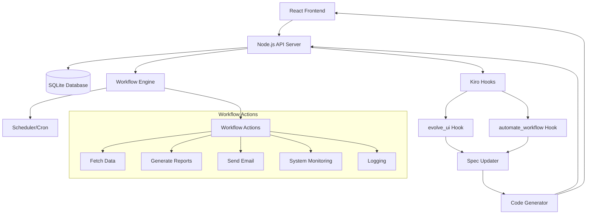

# Design Document

## Overview

The Self-Evolving Workflow Automator is a React-based dashboard application with a Node.js backend that can dynamically evolve its own UI and automate workflows. The system uses a spec-driven architecture where natural language requests are processed to update application specifications, which then trigger automatic code generation and deployment.

## Architecture

### High-Level Architecture



### Component Architecture

- **Frontend (React + Tailwind CSS)**
  - Dashboard Home Component
  - Feature Request Component
  - Workflow Builder Component
  - Dynamic UI Components (generated)

- **Backend (Node.js)**
  - REST API Server
  - Workflow Engine
  - Kiro Hook Handlers
  - Spec Management System
  - Code Generation Pipeline

- **Data Layer (SQLite)**
  - Workflows table
  - Execution logs
  - System metrics
  - Feature requests history

## Components and Interfaces

### Frontend Components

#### Dashboard Home Component
```typescript
interface DashboardHomeProps {
  widgets: Widget[]
  activeWorkflows: WorkflowStatus[]
  recentChanges: EvolutionLog[]
}
```

#### Feature Request Component
```typescript
interface FeatureRequestProps {
  onSubmitRequest: (request: string) => Promise<void>
  isProcessing: boolean
}
```

#### Workflow Builder Component
```typescript
interface WorkflowBuilderProps {
  onCreateWorkflow: (description: string) => Promise<void>
  existingWorkflows: Workflow[]
}
```

### Backend API Interfaces

#### Workflow Management
```typescript
interface Workflow {
  id: string
  name: string
  description: string
  trigger: {
    type: 'cron' | 'manual' | 'event'
    schedule?: string
  }
  actions: WorkflowAction[]
  status: 'active' | 'paused' | 'error'
}

interface WorkflowAction {
  type: 'fetch_data' | 'generate_report' | 'send_email' | 'check_system_metrics' | 'log_result'
  parameters: Record<string, any>
}
```

#### Evolution System
```typescript
interface FeatureRequest {
  id: string
  description: string
  status: 'pending' | 'processing' | 'completed' | 'failed'
  timestamp: Date
  generatedComponents?: string[]
}

interface EvolutionLog {
  id: string
  type: 'ui_evolution' | 'workflow_creation'
  description: string
  timestamp: Date
  changes: string[]
}
```

### Kiro Hook Interfaces

#### evolve_ui Hook
- **Input**: Natural language feature request
- **Process**: Parse request → Update spec → Generate React components → Deploy
- **Output**: New UI components integrated into dashboard

#### automate_workflow Hook
- **Input**: Natural language workflow description
- **Process**: Parse workflow → Generate workflow spec → Create backend handlers → Schedule
- **Output**: Active workflow added to system

## Data Models

### Database Schema

```sql
-- Workflows table
CREATE TABLE workflows (
  id TEXT PRIMARY KEY,
  name TEXT NOT NULL,
  description TEXT,
  spec TEXT NOT NULL, -- JSON workflow specification
  status TEXT DEFAULT 'active',
  created_at DATETIME DEFAULT CURRENT_TIMESTAMP,
  updated_at DATETIME DEFAULT CURRENT_TIMESTAMP
);

-- Execution logs
CREATE TABLE execution_logs (
  id INTEGER PRIMARY KEY AUTOINCREMENT,
  workflow_id TEXT,
  status TEXT, -- 'success', 'error', 'running'
  message TEXT,
  execution_time DATETIME DEFAULT CURRENT_TIMESTAMP,
  duration_ms INTEGER,
  FOREIGN KEY (workflow_id) REFERENCES workflows(id)
);

-- Feature requests
CREATE TABLE feature_requests (
  id TEXT PRIMARY KEY,
  description TEXT NOT NULL,
  status TEXT DEFAULT 'pending',
  created_at DATETIME DEFAULT CURRENT_TIMESTAMP,
  completed_at DATETIME,
  generated_files TEXT -- JSON array of generated file paths
);

-- System metrics
CREATE TABLE system_metrics (
  id INTEGER PRIMARY KEY AUTOINCREMENT,
  cpu_usage REAL,
  memory_usage REAL,
  timestamp DATETIME DEFAULT CURRENT_TIMESTAMP
);
```

## Error Handling

### Frontend Error Handling
- Global error boundary for React components
- Toast notifications for user feedback
- Graceful degradation when dynamic components fail
- Retry mechanisms for API calls

### Backend Error Handling
- Centralized error middleware
- Workflow execution error recovery
- Database connection error handling
- Kiro hook execution error logging

### Workflow Error Handling
- Individual workflow failure isolation
- Automatic retry with exponential backoff
- Error notification system
- Fallback mechanisms for critical workflows

## Testing Strategy

### Unit Testing
- React component testing with Jest and React Testing Library
- Node.js API endpoint testing with Jest and Supertest
- Workflow engine logic testing
- Database operation testing

### Integration Testing
- End-to-end workflow execution testing
- Kiro hook integration testing
- Database integration testing
- API integration testing

### System Testing
- Full feature request to UI generation flow
- Complete workflow creation and execution cycle
- Performance testing under load
- Error recovery testing

### Testing Tools
- **Frontend**: Jest, React Testing Library, Cypress
- **Backend**: Jest, Supertest, SQLite in-memory for tests
- **E2E**: Playwright or Cypress
- **Performance**: Artillery or k6